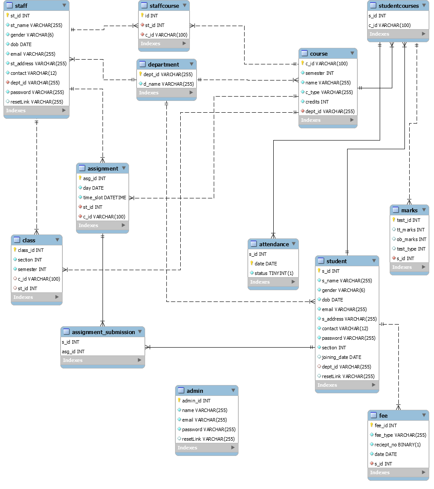

# CUMS_DBMS
🏰 A College Management Site (DBMS) using Node and Mysql.

A college management system (web application) that provides complete funtionality to manage enrollment, students, faculty, attendance, fees, scheduling,
assignments and grades for a particular college.It uses Node.js for backend and MySql as Database. It uses REST APIs for client server communications.

## ER Diagram

_Note: All attributes with :key: (key) are primary keys. The ones having red :diamonds: are foreign keys.

